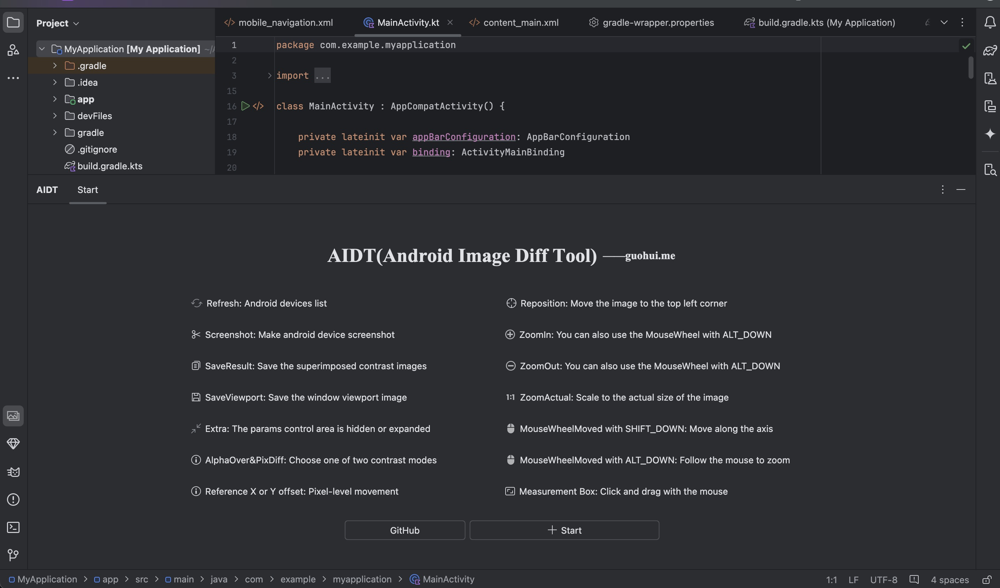
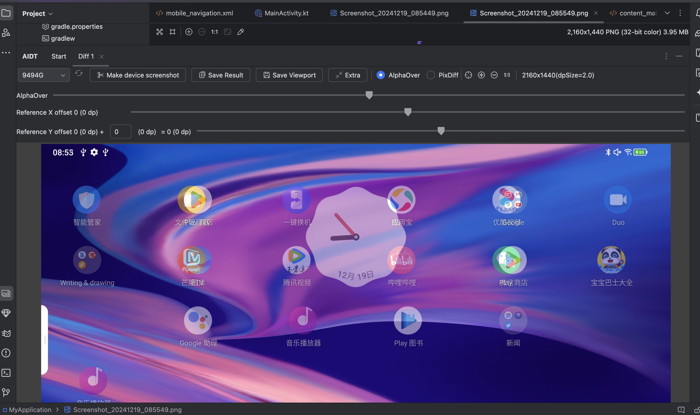
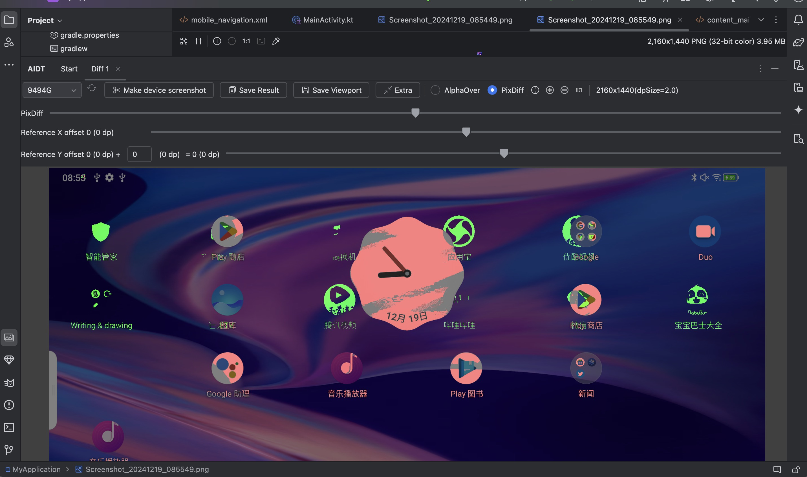

# AIDT
Android Image Diff Tool  
This plugin is used in AndroidStudio to help Android developers compare device screenshots with external images (such as those provided by UI designers) to determine the difference between the two images. The comparison can be done by AlphaOver and PixDiff difference. This allows the UI development effect of the app to be highly restored and adjusted as quickly as possible. 

该插件用于AndroidStudio上，用于帮助Android开发者通过设备截图和外部的图片(如UI设计同学提供的)进行对比，用于判断两张图片的差异，可通过透明度和像素差异两种方式进行对比。这样可以将app的UI开发效果根据设计稿进行高度的还原和最快调整

## Install（安装方式）
Marketplace:uploading  
Local install: Download the latest plugin package in the dist directory. Android Studio-> Settings-> Plugins-> Gear -> Install from disk 
For studio 2022.2 and later(适用于 studio 2022.2 及更高版本)

## Features(功能介绍)
<h3>Key features:</h3>
<ul>
<li>Refresh: Android devices list</li>
<li>Screenshot: Make android device screenshot</li>
<li>SaveResult: Save the superimposed contrast images</li>
<li>SaveViewport: Save the window viewport image</li>
<li>Extra: The params control area is hidden or expanded</li>
<li>AlphaOver&PixDiff: Choose one of two contrast modes</li>
<li>Reference X or Y offset: Pixel-level movement</li>
<li>Reposition: Move the image to the top left corner</li>
<li>ZoomIn: You can also use the MouseWheel with ALT_DOWN</li>
<li>ZoomOut: You can also use the MouseWheel with ALT_DOWN</li>
<li>ZoomActual: Scale to the actual size of the image</li>
<li>MouseWheelMoved with SHIFT_DOWN: Move along the axis</li>
<li>MouseWheelMoved with ALT_DOWN: Follow the mouse to zoom</li>
<li>Measurement Box: Click and drag with the mouse</li>
</ul>

主要功能点
1. 窗口多开：首页功能介绍，可以点击Start按钮开启多窗口
2. 设备列表：通过环境变量中的adb命令获取设备列表，右侧刷新按钮可刷新
3. 设备截图：点击’Make device screenshot‘获取当前Android连接设备截图
4. 添加对比图片：从文件夹中拖动一张图片(png)到AIDT的插件窗口
5. 选择对比模式：可以选择AlphaOver和PixDiff两种图片对比模式
6. 保存对比图片：对比的叠加图片整图大小保存到AIDT_Files目录中
7. 保存可见图片：叠加图片插件窗口可见大小保存到AIDT_Files目录中
8. 隐藏操作区：对比值、图片位移值进度条操控区域隐藏和显示
9. 图片操作：重定位图片左上角到窗口左上角为止，图片放大、缩小、1:1
10. 图片大小和对应dp值：显示当前截图图片尺寸大小以及设备对应px与dp对应关系
11. 对比值设置：选择AlphaOver(默认)或者PixDiff后，可拖动第一个进度条进行
12. 对比图片X位移：操作横向左右移动多少个像素（同步转换成dp值）
12. 对比图片Y位移：操作竖向左右移动多少个像素（同步转换成dp值）
13. 快速水平位移：按下shift键，滚动鼠标滑轮，快速向左或者向右移动
14. 快速缩放图片：按下alt键，滚动鼠标滑轮，可根据鼠标位置放大或缩小图片
15. 测距：图片上点击鼠标左键然后拖动鼠标，进行区域大小测定，显示px和dp，右键取消

## Getting started:
show plugin: "View" -> "Toolwindow" -> "AIDT" -> "Start(open new tab)"  
Usage steps: First, click the screenshot button to take a screenshot of the device, and then drag an image from the folder to the plugin workspace. Next, we can diff happily

## Suggestion(建议)
When you take screenshots and save images, an AIDT_Files folder will be automatically added to your current project. You can add /AIDT_Files to the .gitignore file to ignore this directory when committing code.  
截图和保存图片时会自动在你当前的项目中添加一个AIDT_Files文件夹，您可以在.gitignore文件中添加/AIDT_Files用来在提交代码时忽略该目录

## Feedback(反馈)
If you find any bugs or have feature requests,please create an [issue](https://github.com/maguohui/AIDT/issues) on this Github page

